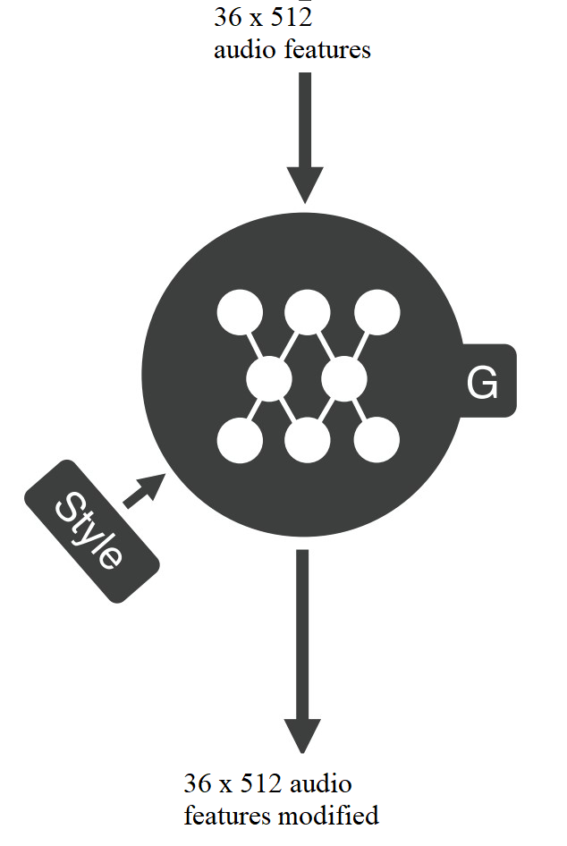
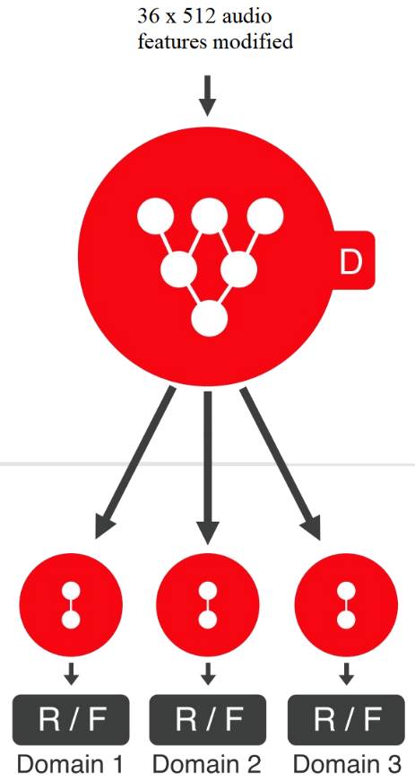

# Voice-Conversion-GAN
Voice Conversion using Modified StarGAN (PyTorch Implementation). Architecture of the Modifeid StarGAN is as follows:


<div class="row">
  <div class="column">
    
  </div>
  <div class="column">
    
  </div>
</div>

.column {
  float: left;
  width: 33.33%;
  padding: 5px;
}

/* Clear floats after image containers */
.row::after {
  content: "";
  clear: both;
  display: table;
}


## Dependencies

* Python
* Numpy 
* PyTorch 
* LibROSA 
* PyWorld


## Usage

### Download Dataset

Download and unzip [VCC2018](https://datashare.ed.ac.uk/handle/10283/3061) into google drive.


### Preprocessing for Training

You can find the colab link for the preprocessing part : [Here](https://colab.research.google.com/drive/1ToP__nLY9MmGYGk-z51TbZFtAwz_ehaO?usp=sharing)


### Train Model


You can find the colab link for the training part : [Here](https://colab.research.google.com/drive/1cOHdN7YKS4oeHpAOoZi9LiHR_7_LL1KJ?authuser=1#scrollTo=ibweOJNN2lmH&uniqifier=1)

```bash
$python train.py 
```                                                

